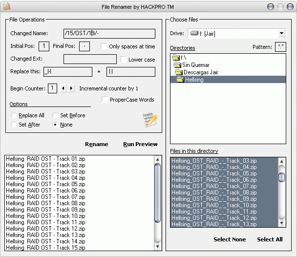



## File Renamer 1\.0 \(Update\)

### Description

With this program you can rename any file, using some important characteristics, as:

- To move words, utilize / to indicate where you want to move the word.

- To remove or replace not wanted characters.

- To give sequence to the files, i.e 1, 2, 3.

- To change the extensions and to put them in minuscule.

- To place the first character of each word in capital.

- To remove two or more spaces among words.

Comments and votes is wellcome.

UPDATE

Now with a great appearance, thanks to my friend John Underhill (Steppenwolfe).

Please visit the link CodeId = 3163 and CodeId = 64357.
 
### More Info
 

             |
---                |---
**Submitted On**   |2006-03-24 13:32:42
**By**             |[Heriberto Mantilla Santamaria](https://github.com/Planet-Source-Code/PSCIndex/blob/master/ByAuthor/heriberto-mantilla-santamaria.md)
**Level**          |Intermediate
**User Rating**    |5.0 (35 globes from 7 users)
**Compatibility**  |VB 5\.0, VB 6\.0
**Category**       |[Complete Applications](https://github.com/Planet-Source-Code/PSCIndex/blob/master/ByCategory/complete-applications__1-27.md)
**World**          |[Visual Basic](https://github.com/Planet-Source-Code/PSCIndex/blob/master/ByWorld/visual-basic.md)
**Archive File**   |[File\_Renam1982683242006\.zip](https://github.com/Planet-Source-Code/heriberto-mantilla-santamaria-file-renamer-1-0-update__1-64682/archive/master.zip)

